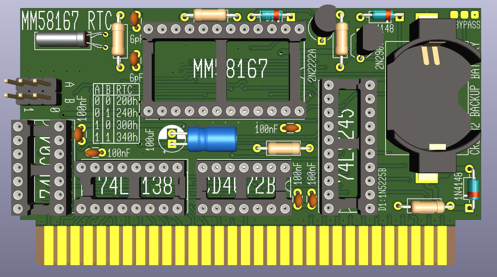
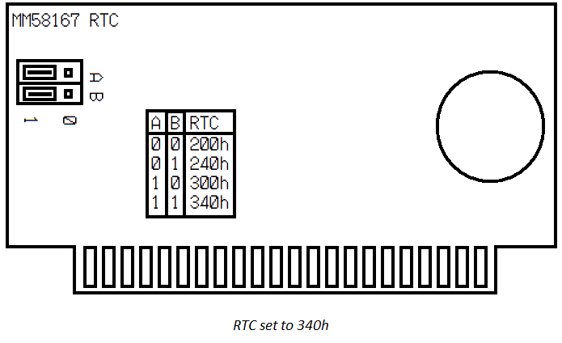
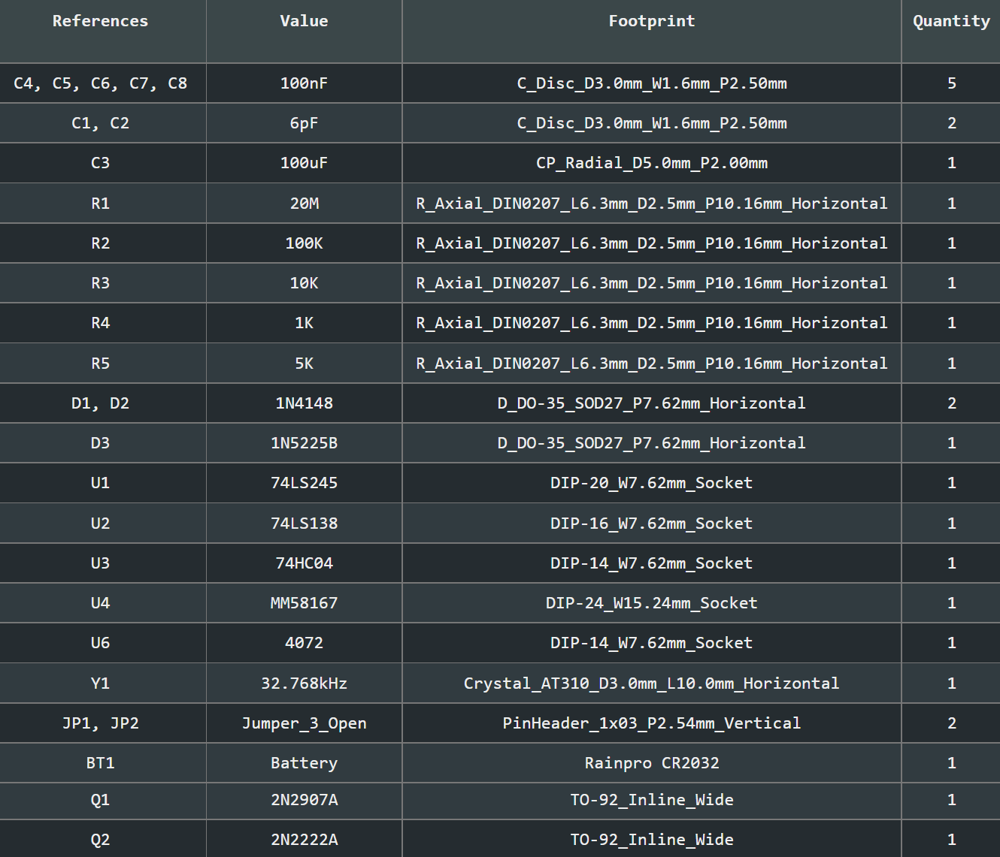
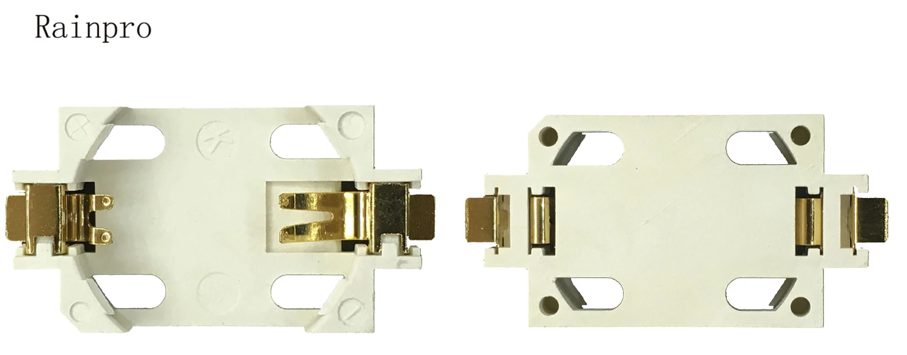

# MM58167-ISA-RTC


## What is this?
A 8bit real time clock for old computers. Keeps the time when the computer is shut down. Fully covered address bus to prevent conflicts.


## Why is this?
Yes, there are many more modern RTC's out there. I made this just for fun and with parts that were readily available back in the 80s. I like to keep things period correct 😉 All parts and even the software were readily available back then.


## How to use it?
First set the jumpers for the RTC. You can choose between 200h, 240h, 300h and 340h.



*RTC set to 340h*


Plug the card into a free ISA slot, either 8bit or 16bit.

[Download the program to control,](./prog/MM58167.EXE) the RTC, or download [the source, modify it to your liking and compile it with QuickBasic 7.1](./prog/MM58167.BAS)

```
Usage:
------

MM58167.EXE ADDRESSh SET|GET [VERBOSE] [FORCE]

Adressh:   The address of the RTC, set by jumpers on the PCB, e.g. 240h
SET|GET:   Sets the RTC to the system clock and vise versa.
[VERBOSE]: Outputs some information.
[FORCE]:   Skip detection of RTC.

Examples:
To write the system time to the RTC, setup at 300h:
MM58167.EXE 300h SET

Set the RTC's time to the system's clock:
MM58167.EXE 300h GET

--------------------------------------------------------
Credits to:
github.com/mrehkopf/ & github.com/Sciurus68k/

Project page:
github.com/jensma-de/MM58167-ISA-RTC/
```


Only if you're having problems with the interrupt output: cut the trace between the two pads of the jumper in the top left corner of the pcb. Then close the center and the right pad.

## Is this Y2K-compatible?
lol kA

## BOM

**Note for the battery holder**: The holder I used is just labeled "Rainpro". No idea about the exact model. Should be a very common part, though. Here's a picture of the listing:


Alternatively you can download and check out the interactive BOM:
[iBOM](./info/ibom.html)

## Pictures and schematics
[Schematics](./info/schematics.pdf)

[Photo of assembled RTC](./info/assembled.jpg)

## Credit
[@mrehkopf](https://github.com/mrehkopf)
[@Sciurus68k](https://github.com/Sciurus68k)
